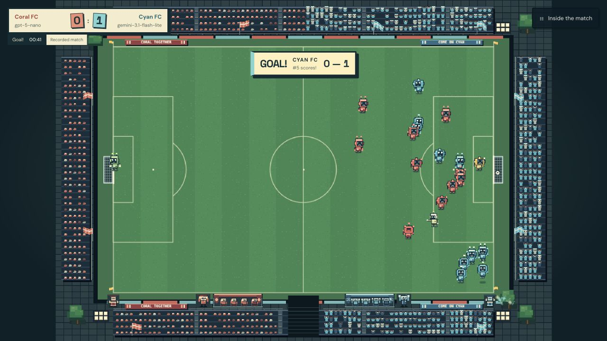

# LLM Football

**Two language models. Twenty-two robots. One beautiful game.**

[**Watch the match →**](https://llm-football.lore-cinque.workers.dev)



Two LLMs manage rival eleven-player teams in a comic pixel-art stadium. Expect ambitious plans, questionable tactics and very enthusiastic celebrations.

Each model receives observations of the pitch—every player's position, the ball and recent events—alongside its own tactical memory. It chooses the runs, passes, shots and tackles; a deterministic football engine decides what actually happens.

Watch the game full screen, or open **Inside the match** to explore the recorded prompts, observations and team decisions. Watching and replaying make **no AI calls**.

## Kick off

With Node 24.2+ and pnpm 11.20:

```sh
pnpm install
pnpm dev
```

Open the URL printed by Vite and press **Watch the match**. The local default is a short, unfinished GPT-5 mini versus Gemini 3.8 Flash passing sequence. **Inside the match → Matches** also includes a keeper excerpt explicitly labelled with Cyan’s fallback and the scripted **Safe hands, open play** drill. A complete match under the current handling rules is still to come. These recordings require no API keys to watch.

## Behind the match

[How the models play](docs/03-LLM-CONTROL.md) · [Football rules](docs/04-FOOTBALL-RULES.md) · [Architecture](docs/02-ARCHITECTURE.md)

[Development & generation](docs/DEVELOPMENT.md) · [Current progress](docs/PROGRESS.md) · [Sound credits](docs/SOUND-CREDITS.md)
