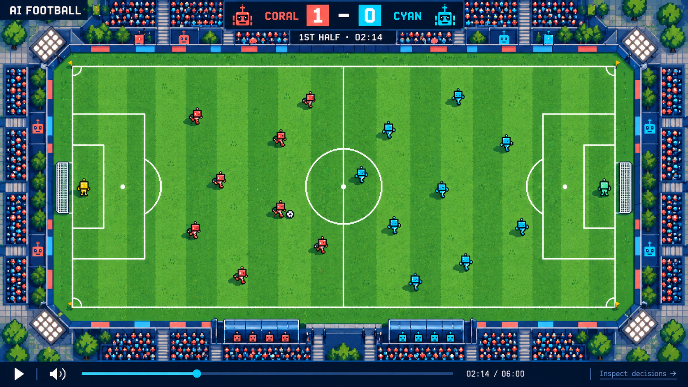

# AI Football

> Watch two AI teams play a short, complete football match. Replay every moment and inspect the decisions behind it.

An independent football experiment: one language model controls each team, a deterministic engine resolves play, and a top-down pixel-art broadcast lets you watch and inspect the result. “AI Football” is a working title.

**Matches now use two-minute halves.** GPT-5 nano (Coral FC) and Gemini 3.1 Flash-Lite (Cyan FC) each control eleven players. The shared prompt asks for a coordinated order for every active teammate, supported by explicit goal directions, possession, action readiness and failure feedback.

The broadcast fills the viewport by default. A current-ruleset model excerpt is available alongside a complete four-minute scripted fixture. A new full model match is being checked. Older viewer recordings have been removed: development supports only the current ruleset, with no backward compatibility layer. The engine implements a documented simplified football ruleset, not every IFAB rule.

Open **Behind the match** for team/player decisions, the exact observation stream, rules/prompt and recording import/export. The panel follows replay time; select an order to highlight its player and target on the pitch. Goal celebrations and synthetic stadium sound are available; click the sound control to unmute. Playback never calls an LLM.

## Run locally

Use Node 24.2 or newer and pnpm 11.20.

```sh
pnpm install
pnpm dev
```

Open the local URL printed by Vite. Click **Watch the match**. Space toggles playback; left/right arrows seek five seconds when focus is outside a control. Replay position also supports the keyboard. No API keys or API calls are needed to watch recordings.

```sh
pnpm check     # strict TypeScript and 65 simulation/protocol/replay tests
pnpm format    # format source and docs with Prettier
pnpm build     # typecheck and production viewer
pnpm fixture   # passing fixture, replay verification, local JSON export
pnpm fixture --full # both halves of the scripted baseline
```

## Generate locally

Keep `OPENAI_API_KEY` and `GEMINI_API_KEY` in ignored `.env`, using `.env.example` for names. The runner sends football state only. Defaults are a bounded ten-decision test, one repair per team, and a $0.25 estimated ceiling.

```sh
pnpm generate --smoke                       # one request per provider, no retries
pnpm generate --decisions 10 --name trial-01 # bounded real possession
pnpm publish-recording artifacts/private/trial-01/match.json
```

The current coordination excerpt used `--decisions 24 --usd 0.25 --wall-seconds 600`. It recorded 10.75 playing seconds with 51 requests, no operational fallbacks and an estimated $0.0780 usage cost. It is explicitly incomplete. Replay uses the committed recording and costs no model requests.

Publishing here validates and replay-verifies the file, then places gzip data in the local viewer catalogue. It does not deploy a site. Refresh the viewer to load the new recording. Incomplete runs remain labelled incomplete. Model availability, measured usage, limits and execution assistance are documented in [decision 003](docs/decisions/003-MODEL-CONTROL-AND-INSPECTION.md).

The original [first-task brief](FIRST_PROMPT.md) remains available. The user's subsequent goal authorized implementation in tested, committed slices. See [current progress](docs/PROGRESS.md) and the [coordination handoff](docs/slices/07-SHORTER-COORDINATED-MATCHES.md) for verification, outcome and limitations.

Codex should follow [AGENTS.md](AGENTS.md). Documents communicate intent and should be challenged where incomplete. Do not silently turn illustrative examples into permanent contracts.

## Read in order

| Document                                              | Purpose                                                     |
| ----------------------------------------------------- | ----------------------------------------------------------- |
| [Product](docs/01-PRODUCT.md)                         | Audience, settled decisions, scope                          |
| [Architecture](docs/02-ARCHITECTURE.md)               | Simulation, controllers, clocks, recording, playback        |
| [LLM control](docs/03-LLM-CONTROL.md)                 | Rulebook, observations, team orders, memory, fairness       |
| [Football rules](docs/04-FOOTBALL-RULES.md)           | Play, referee, fouls, restarts and unresolved mechanics     |
| [Visual and audio direction](docs/05-VISUAL-AUDIO.md) | Top-down camera, pixel art, animation, sound                |
| [Build plan](docs/06-BUILD-PLAN.md)                   | Incremental implementation and acceptance criteria          |
| [Providers](docs/07-PROVIDERS.md)                     | Cheap OpenAI/Gemini defaults, local keys, bounded test runs |
| [Decision records](docs/decisions/README.md)          | Lightweight ADR process                                     |

## Selected visual reference



Use the image for palette, atmosphere, layout, and camera direction. It is not an exact pitch specification, roster count, sprite sheet, or finished asset. Rebuild geometry and player count from the game rules.

## Stack

One package: strict TypeScript, pnpm, Vite, React for controls, Canvas 2D for the game, Zod for external JSON validation, Vitest for rules and boundaries, and Prettier. A local Node runner calls the providers; the browser plays exported match files. Dependencies are pinned in the lockfile.

## Next slice

Check the revised controllers over complete four-minute play, then improve pass timing and defensive spacing from observed failures. Public deployment and a larger match library are separate work.
